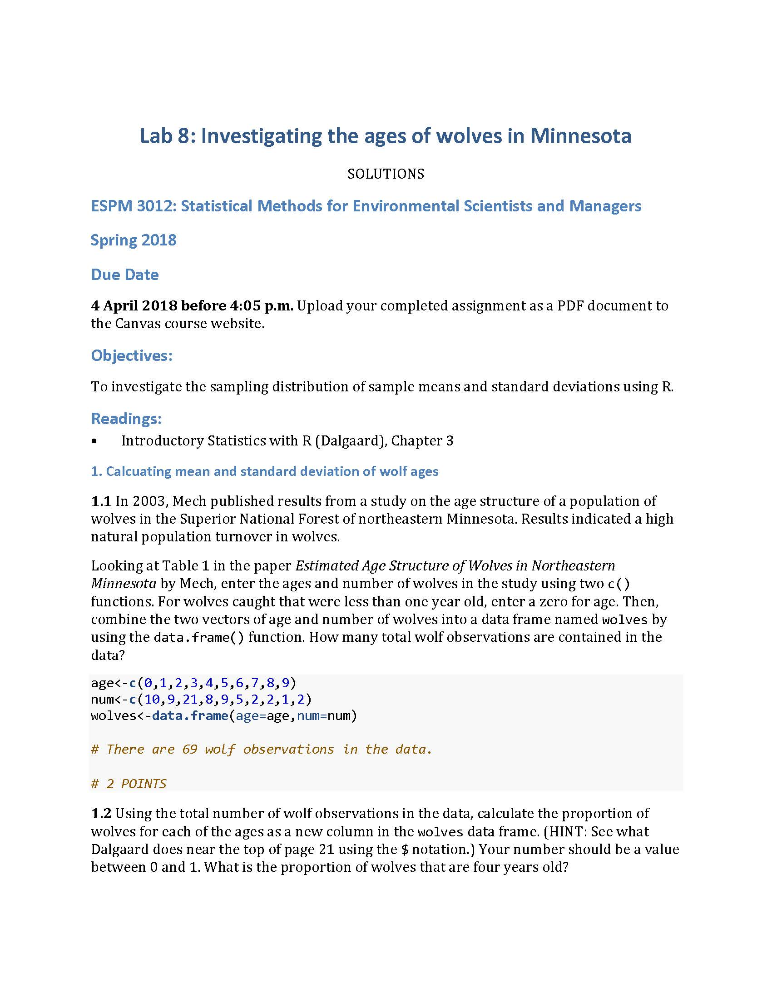
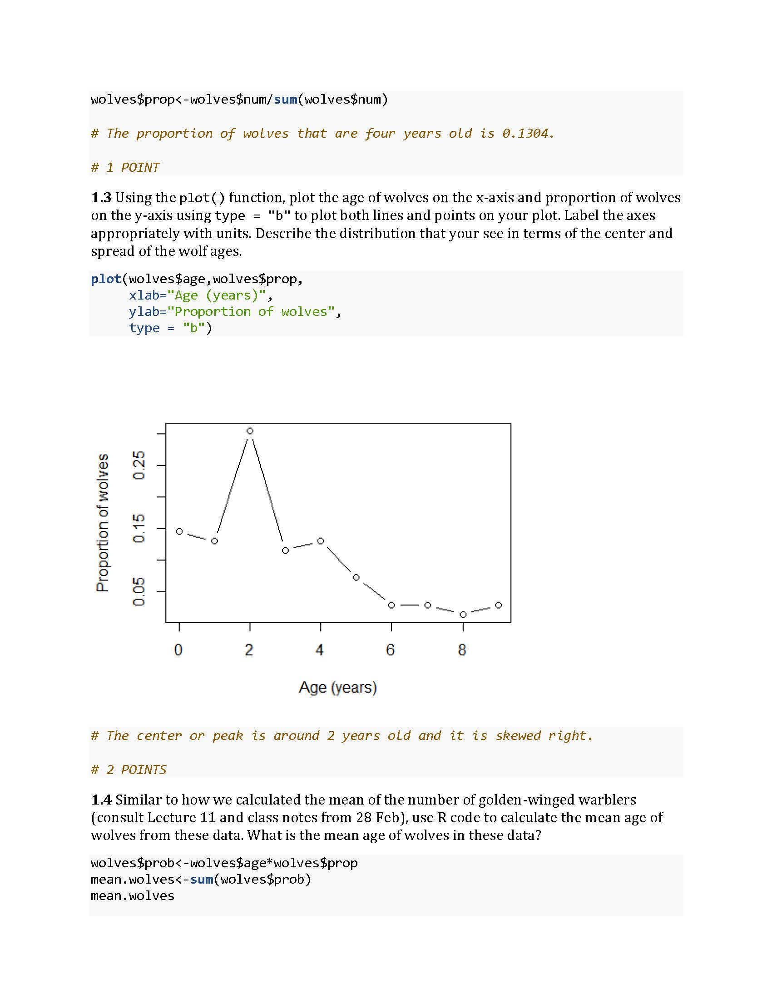
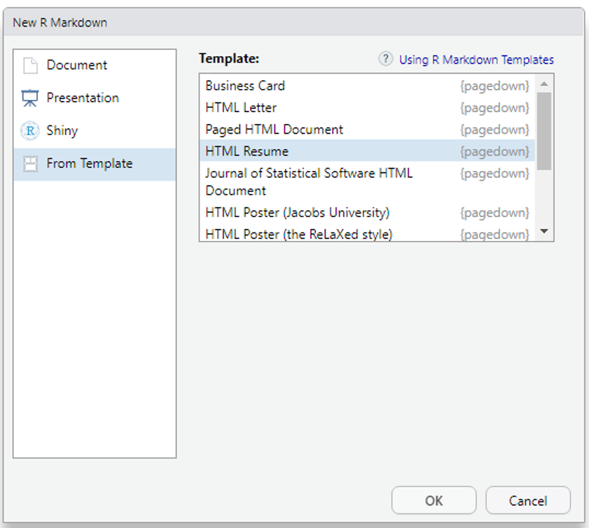
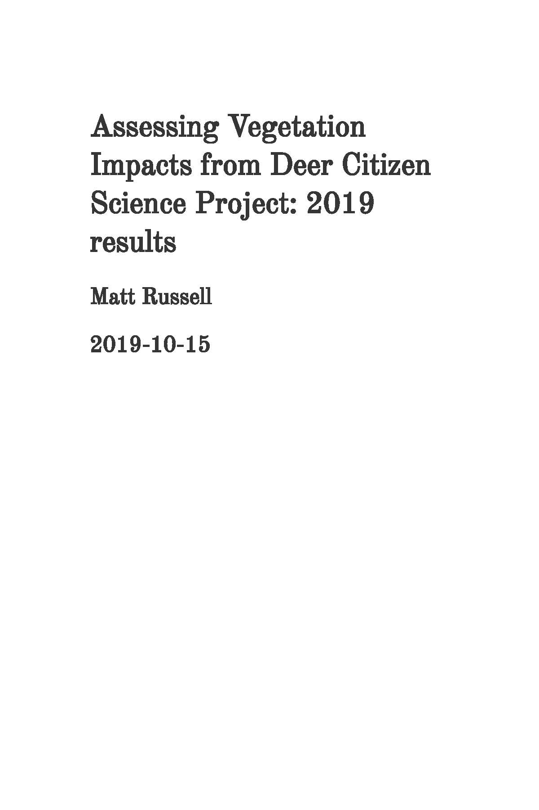
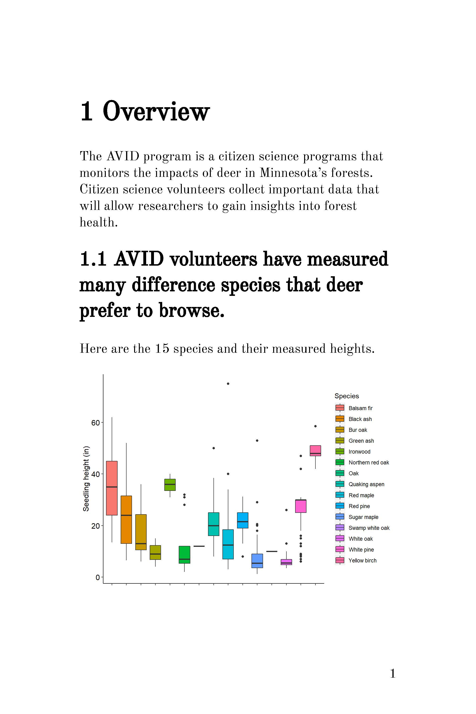
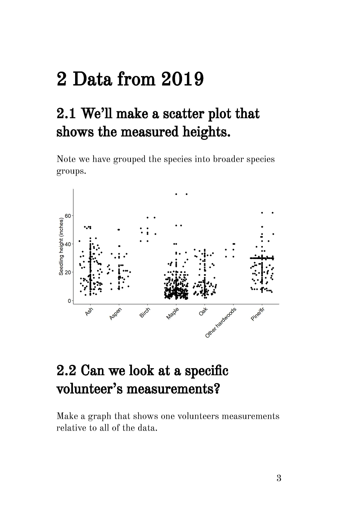
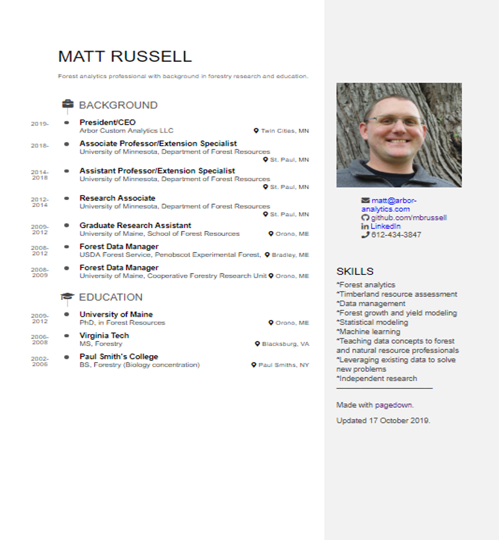

Getting down with pagedown: Using R Markdown to create paged HTML documents
========================================================
autosize: true
author: Matt Russell, PhD
date: 17 Oct 2019
Twin Cities R User Group 


About
========================================================

 
***

University of Minnesota, Department of Forest Resources
- Associate Professor
- Instruct a graduate class in statstics in natural resources
- Research and outreach on forest health issues


Arbor Custom Analytics LLC
- Consulting for the forest products industry.


The value of R Markdown
========================================================

***

Markdown integrates text and R code.
- Reports are fully reproducible 
- Supports static and dynamic output formats (e.g., HTML, PDF, MS Word)
- Adapted to use R, Python, and SQL languages


R Markdown documents facilitate learning R and statistics
========================================================



***



R Markdown: more than just documents
========================================================

- Themed documents 
- Presentations (like this one!)
- Books (bookdown)
- Dashboards (flexdashboard)
- Websites (blogdown)

***


What is pagedown?
========================================================
- Contains output formats for paged HTML documents, letters, resumes, posters, business cards, etc.
- Uses Paged.js (Javascript library) to paginate web documents
- Can include headers, footers, and page margins to make elegant documents

The package can be installed from Github:


```r
remotes::install_github('rstudio/pagedown')
```

New pagedown file in RStudio
========================================================
- **File** -> **New File** -> **R Markdown** -> **From Template**
- Several templates available

***




pagedown:: html_paged
========================================================

- Creates a paged HTML document.
- Can include table of contents and numbered sections.
- Example: citizen science project showing data.


```r
output:
  pagedown::html_paged: 
    toc: true
    number_sections: true
```


An example: Cover of a paged HTML document
========================================================


***


page 1
========================================================

***


pages 2-3
========================================================

***


pages 4-5
========================================================

***


pages 6-7
========================================================

***


pagedown::html_resume
========================================================

- Two parts: an **Aside** and **Main** section


```r
---
title: "resume_example"
author: "Matt Russell"
output: pagedown::html_resume
---
```

***




pagedown::business_card
========================================================

- Single card for an individual
- Multiple cards for several employees on the same page

```r
---
name: Matt Russell, PhD
output: pagedown::business_card
---
```

***


Other pagedown documents
========================================================

- Letters
- Theses/dissertations
- Posters
- Journal articles

Other features
- Cover pages
- Lists of tables and figures
- Custom running headers
- Page references
- Line numbering

***


Pros/cons of pagedown
========================================================
Pros
- Create high-quality PDFs through a web browser
- Flexible if you know CSS and Javascript

***

Cons
- Works best on Chrome or Chromium
- May need to use with `xaringan` to print to web browser (and the "Infinite Moon Reader" function)


```r
xaringan::inf_mr("my_resume.Rmd")
```


Learn more!
========================================================
Pagedown documentation
- [pagedown from Github](https://github.com/rstudio/pagedown)
- [pagedown documentation](https://pagedown.rbind.io/)
- VIDEO: [Yihui Xie presentation at rstudio::conf 2019](https://resources.rstudio.com/rstudio-conf-2019/pagedown-creating-beautiful-pdfs-with-r-markdown-and-css) 
- SLIDES: [Yihui Xie presentation at rstudio::conf 2019](https://slides.yihui.name/2019-rstudio-conf-pagedown.html#1) 

Other applications
- [A quick ride on pagedown](http://www.andreacirillo.com/2019/01/27/a-quick-ride-on-pagedown-create-pdf-from-rmarkdown/). Blog post by Andrea Cirillo.
- [A CV built with pagedown](https://github.com/nstrayer/cv). Code by Nick Strayer.

Thanks to the main authors Yihui Xie and Romain Lesur and other contributors!
